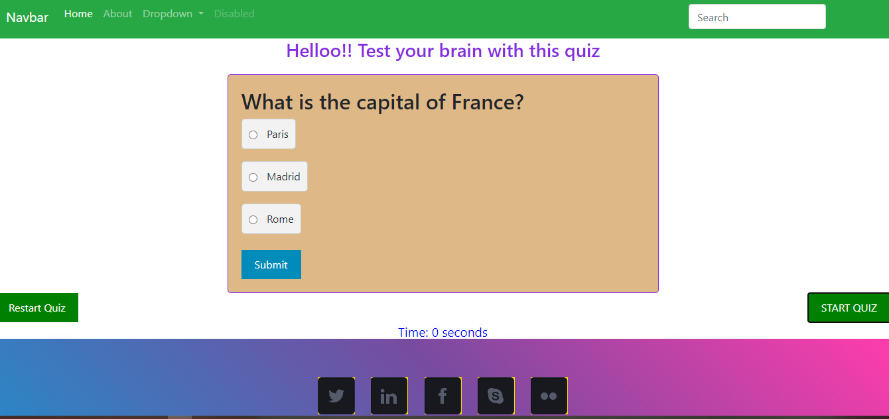

# Quiz-Application-BCA

## Description:
* This is a school project- It is a quiz web application that  has set of questions with multiple choice questions, and should the right answer is chosen, it tell you the number of questions you got right and the number you got wrong.

## Installation:
* This application does not require the traditional way of installation, all that is required is to git clone this repository to your local PC, use any code editor application like VS Code, to launch the application through its live server extension. OR, after git cloning, just use open the index file and the application will launch. But make sure you are connected to the internet while doing this is because the application is deployed to github pages which is live.

  ## Usage:
  The application is used pretty much same as the its installation process.

  ## License:
  Refer to the MIT license within the repository.
  Use this application ethically or responsibly.

  ## Technologies used:
  * HTML
  * CSS
  * JAVASCRIPT
  * GITHUB PAGES
  * BOOTSTRAP

## Contributions:
This project is welcome for any contributions to improve the application.

## Screenshots:
* 

## Deployed link
* https://damiennsoh.github.io/Quiz-Application-BCA/

## Developer:
* Damien N. Ayine|[Damiennsoh](https://github.com/Damiennsoh)|
